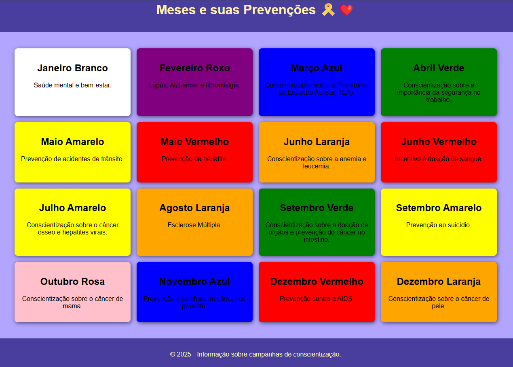

# Meses e suas Prevenções 🎗️❤️

Este é um projeto simples desenvolvido para exibir as campanhas de conscientização ao longo do ano, com foco em saúde, bem-estar e causas importantes. A página é dinâmica e mostra informações sobre os meses e suas respectivas prevenções de forma visual e interativa.

## Tecnologias Utilizadas 💻🛠️

- HTML5: Estrutura semântica e acessível.
- CSS3: Design moderno e responsivo, utilizando flexbox e grid para layout.
- JavaScript: Criação dinâmica dos artigos e interação com o conteúdo.

## Objetivo do Projeto 📋

O objetivo deste projeto é proporcionar uma forma fácil de acessar informações sobre as campanhas de conscientização de cada mês, como Novembro Azul, Outubro Rosa, Setembro Amarelo e muitos outros. Este projeto foi criado como parte do meu aprendizado em desenvolvimento front-end.

## Funcionalidades 💻

- Apresentação de todos os meses do ano com informações sobre campanhas de conscientização.
- Design responsivo que se adapta a diferentes tamanhos de tela.
- Interatividade: Cada mês tem sua cor representativa e descrição.

## Como Rodar o Projeto Localmente ⚙️

1. Clone o repositório:
   git clone https://github.com/seu-usuario/meses-e-prevencao.git

2. Acesse o diretório do projeto:
   cd meses-e-prevencao

3. Abra o arquivo index.html no seu navegador.
   O projeto estará pronto para ser visualizado localmente!

# O projeto

.

## Contribuições

Sinta-se à vontade para contribuir com melhorias para o projeto! Se você encontrar algum problema ou tiver sugestões, abra uma issue ou envie um pull request.

# Autores

| [ Antonio Tiburtino](https://github.com/antoniotiburtino) |
| :---------------------------------------------------------------------------------------------------------------------------------------------------------------: |
